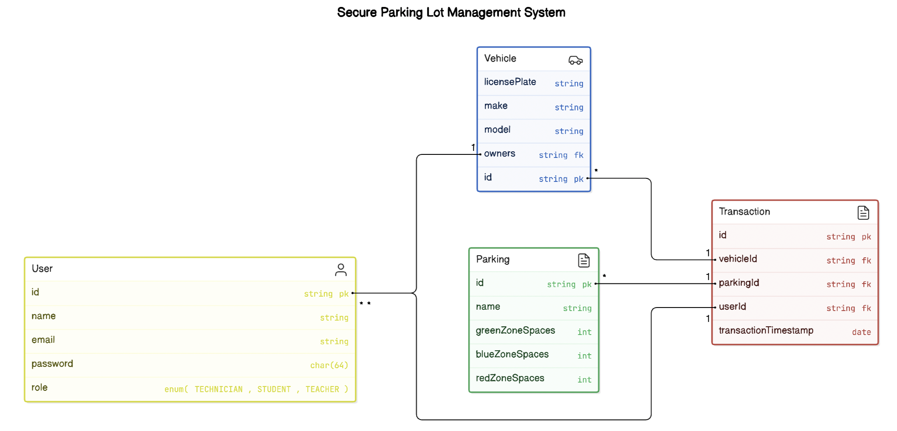
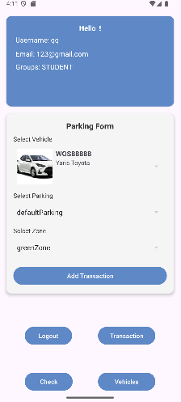

# GENERAL INFORMATION

The purpose of this project is to create a comprehensive Parking Management System that efficiently manages vehicle
access and ensures smooth operation in parking zones. The system leverages technologies such as Django for the backend,
Android (Java) for the mobile interface, and STM32 for hardware-level operations.

# PROJECT STRUCTURE

The project is organized as follows:

- *Parking_Managament_System/* - Django backend application
- *Stm32/* - STM32 code (F411RE)
- *Parking_Managament_System_App/* - Android mobile app (Java)

# DEPENDENCIES

CODING LANGUAGE:

- C
- Python
- Java

IDE:

- PyCharm Community
- Android Studio
- STM32CubeIDE

FRAMEWORK:

- Django
- Rest
- SQLite
- Android SDK

# FEATURES

- Vehicle access control based on user roles (e.g., administrator, staff, regular user).
- Real-time notifications on parking events and zone access displayed on an SSD1306 screen.
- A mobile application for managing user access, checking parking availability, and searching for vehicles.
- Integration with the database to store and retrieve user and vehicle data.
- Communication between hardware components (STM32) and the backend for barrier control and sensor input.

## REQUIREMENTS

The following dependencies are required for the project:

- **asgiref**: 3.8.1
- **Django**: 5.1.3
- **djangorestframework**: 3.15.2
- **djangorestframework-simplejwt**: 5.3.1
- **Pillow**: 11.0.0
- **PyJWT**: 2.9.0
- **pyserial**: 3.5
- **pytz**: 2024.2
- **sqlparse**: 0.5.1
- **tzdata**: 2024.2

### Installation

You can install the dependencies using `pip` by running the following command:

```bash
pip install -r requirements.txt
```

# DATABASE STRUCTURE



# SCREENSHOTS


<p align="center">

</p>